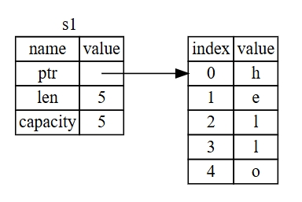
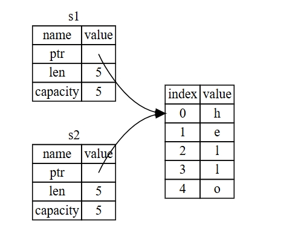
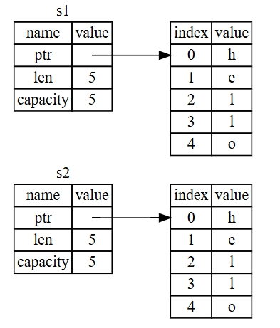

## 移动的变量和数据交换

在Rust中，多个变量可以采用不同的方式于同一数据进行交互。下面的例子就是一个使用整型的例子

```rust
    let x = 5;
    let y = x;

    println!("x => {x}");
    println!("y => {y}");
```

从上面的代码中可以看出，创建了一个变量 `x` ,将 5 赋值给 `x`。接着生成一个 `x` 的副本并绑定到 `y`。现在有两个变量， `x` `y` 都等于 5 .这也是事实上发生的，因为整数时有已知大小的简单值，所以这两个变量都被压入的栈中。

下面再来看看 `String` 版本

```rust

    let s1 = String::from("hello");
    let s2 = s1;

    println!("s1 => {s1}");
    println!("s2 => {s2}");

```

#### String 赋值错误

```rust

borrow of moved value: `s1`
value borrowed here after moverustcClick for full compiler diagnostic
macros.rs(143, 28): Error originated from macro call here
macros.rs(143, 28): Error originated from macro call here
main.rs(24, 5): Error originated from macro call here
main.rs(22, 14): value moved here
main.rs(21, 9): move occurs because `s1` has type `String`, which does not implement the `Copy` trait
main.rs(22, 16): consider cloning the value if the performance cost is acceptable: `.clone()`
```

这是因为 `String` 和整形类型不同，下面来看看具体是怎么回事

这个图中展示了创建 `s1` 并赋值的过程

<div align="center">
    
</div>

在图中，存在一个指向存放字符串内容内存的指针，一个长度和一个容量。这一组数据存储在栈上。**右侧则是堆上存放内容的内存部分**。

长度 `len` 表示 `String` 的内容当前使用了多少字节的内存。容量是 `String` 从分配器总共获取了多少字节的内存。长度与容量的区别是很重要的，不过在当前的上下文中并不重要，所以现在可以忽略容量。

当我们将 `s1` 赋值给 `s2`的时候，`String` 的数据被复制了，这意味着我们从栈上拷贝了它的指针、长度和容量。我们并没有复制指针指向堆上的数据。换句话说，内存中的数据表现形式如下图所示

<div align="center">
    
</div>

这个表现形式不像下图中那样，如果Rust也拷贝了堆上的数据，那么内存看起来就是这样的。如果Rust这样做了，那么操作 `s2 = s1` 在堆上数据比较大的时候会对运行时性能造成很大的影响。

<div align="center">
    
</div>

之前我们提到过当变量离开作用域后，Rust自动调用 `drop` 函数并清理变量的堆内存。不过图4-2展示了两个数据指针指向了同一个位置。这就存在一个问题：当`s2` 和 `s1` 离开作用域，他们都会尝试释放相同的内存。这是一个叫做 **二次释放** 的错误，也是之前提到过的内存安全性bug之一。两次释放(相同)内存会导致内存污染，它可能会导致潜在的安全漏洞。

为了确保安全，在let s2 = s1; 之后 ，Rust会认为 `s1` 不再有效，因此Rust不需要`s1` 离开作用域后清理任何东西。所以会得到 [上述的错误](4.4_var_move_change.md#string-赋值错误)，因为Rust禁止使用无效的引用。

